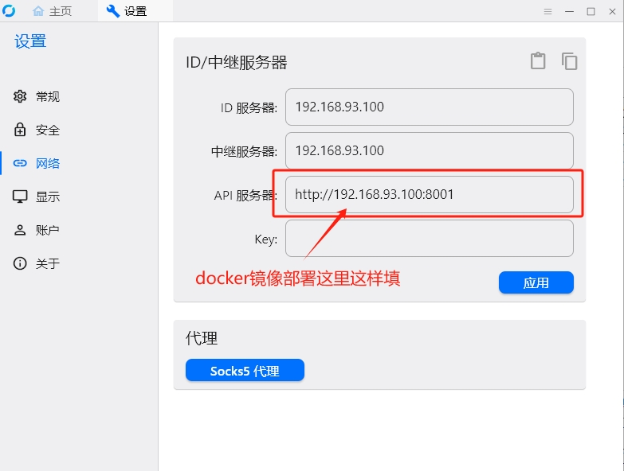
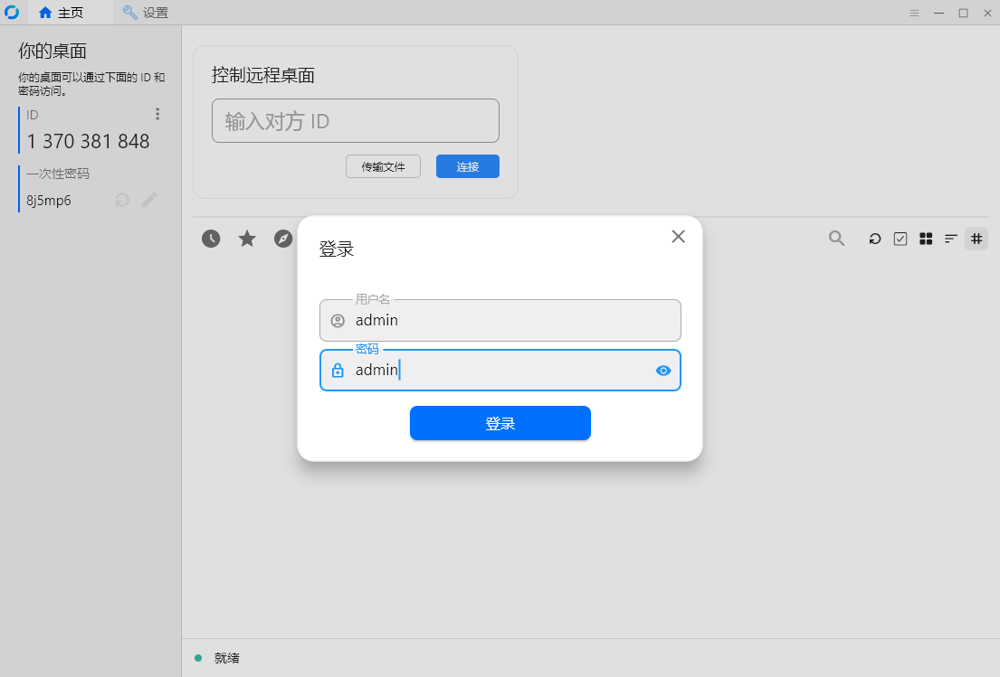

# rustdesk-api
rustdesk远控软件自建API服务器，rustdesk地址薄服务接口，自己架设后，可以方便的管理自己设备ID以及密码

感谢[rustdesk](https://github.com/rustdesk/rustdesk/releases/) 提供这么好的软件，更多详情请关注[rustdesk](https://github.com/rustdesk)。

# 优点：
- 不用记哪些烦人的ID了
- 新增，可以一键登录，设备连接密码也存到服务器上了
- 可以看设备状态
- 自定义设备ID（这个很香）
- 开启允许IP直接访问（这个也很香）

# 新增或修改
- 支持rustdesk 1.2.3，支持用户组
- 优化了dockder镜像体积，现在为 32.41 MB
- 增加Docker部署，修改nginx为 1.24.0 ，php为 8.3.2
- 用户的添加和删除，方法见下面食用方法
- 新增mysql版本的api
- 修改sqlite版设备连接密码的更新


# 食用方法
1. 在php环境的服务器上新增一个网站。
2. 把数据库对应的版本的php文件拷贝到根目录。如：SQLite版的在``` sqlite ```文件夹下
3. 在客户端ID/中继服务器里设置API服务器为：http://你到域名或IP:端口
   ```
    如：http://192.168.0.1:8080
   ```
   ### 注：源码部署需要在web服务器上配置伪静态，否则获取分组有问题。nginx代码如下(其他自行百度)：
   ```nginx
   location / {        	
      if (!-e $request_filename) {
          rewrite  ^/(.*)$  /index.php?s=/$1  last;
      }
   }
   ```
5. 首次运行先访问http://你到域名或IP:端口/index.php?ac=runonce 创建数据库以及用户名密码。（mysql版本没有此方法，自行执行mysql脚本）
   ```
   如：http://www.youdomain.com/index.php?ac=runonce
   ```
6. 默认的登录用户名和密码都是：``` admin ```
7. 新增用户方法：http://你到域名或IP:端口/index.php?ac=add&u=[用户名]&p=[密码]，如：需要添加用户名为：test,密码为：123456 则：
   ```
   http://www.youdomain.com/index.php?ac=add&u=test&p=123456
   ```
8. 删除用户方法：http://你到域名或IP:端口/index.php?ac=del&u=[用户名]&p=[密码]，如：需要删除用户名为：test,密码为：123456 则：
   ```
   http://www.youdomain.com/index.php?ac=del&u=test&p=123456
   ```
   注：删除用户会删除用户以前添加的设备ID及信息
   
# Doceker镜像部署
容器暴露端口为80，可以根据自己服务器实际情况开放宿主机的端口，如下面命令就是把宿主机的端口8000映射到容器的80，为了持久化数据库或使用原来的数据库，所以加了VOLUME：/var/www/data，在创建容器是必须传入。
   ```
   docker run -p 8000:80 -d --name rustdesk -v /www/rustdesk/data:/var/www/data v5star/rustdesk-api
   ```
   注：使用docker部署的，在客户端api里填http://ip:port 即可(见下图)。如：你的宿主机IP为192.168.0.10，对外端口为8000，那么你的就一直填：
   ```
   http://192.168.0.10:8000
   ```  

# Dockder运行参数

|  参数名   | 说明  |
|  ----  | ----  |
| -p  | 端口映射,前边宿主机的端口，后面是容器端口80 |
| -d  | 后台运行 |
| --name  | 友好名称，如：rustdesk |
| -v  | 容器目录/var/www/data 固定值（必须）,如：宿主机linux为：/var/www/data,window为：d:\rustdesk，也可以为一个存储名字 |






# Docker Compose 文件部署
直接用根目录下的docker-compose.yaml运行，如有别的需求可以自行修改。（在yaml文件目录下运行下面命令即可成功）
   ```
   docker-compose up -d
   ```
注意：上面docker-compose.yaml文件中，对外暴露的端口是80端口，直接访问运行效果如下：


# rustdesk-api部署视频教程
```url
   ## 方法1（Doceker镜像部署）:rustdesk-api部署视频教程-1-1.mp4、rustdesk-api部署视频教程-1-2.mp4
   ## 方法2（Docker Compose 文件部署）：rustdesk-api部署视频教程-2.mp4
   ## 方法（源码部署）3：rustdesk-api部署视频教程-3.mp4
下载地址：https://v5star.lanzouo.com/b0plv183a 密码:49az  由于文件上传大小限制，所以只能上链接了。
```
# 已知BUG
- 网络里设置KEY (id_ed25519.pub),即填写那个公钥字符串后，连接远程设备，需要等很长时间，不填这个串，就秒连了，起作用就是就是加密连接，不填会显示一个红叉，不影响使用。（上面第一张图里的Key那里空着就行）
- 简化版的宝塔或者windows版本的宝塔，默认不能一次执行多条sql语句（请自行解决，或者拆分一条一条的执行）

# 客户端下载
   https://github.com/rustdesk/rustdesk/releases/
# 交流方式
   微信：OY-Tianyu 
   注明来意，胡乱加不会通过~！
   不要在52pojie上联系方式了，懂得都懂。

## 致谢
- [rustdesk](https://github.com/rustdesk)
